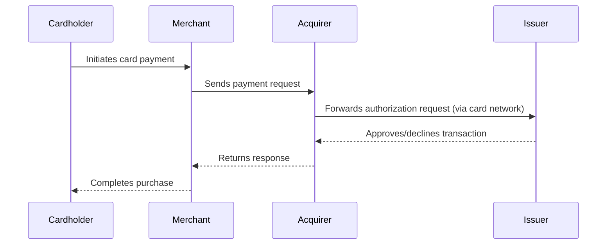

# Cards

## What Are Payment Cards?

**Payment cards** are physical or virtual instruments issued by banks,
Electronic Money Institutions (EMIs), or fintechs that allow users to spend money, withdraw cash, or access funds. Cards
are central to digital payments and often come in various forms: **debit**, **credit**, **prepaid**, and **virtual cards
**.

---

## Types of Cards

| Card Type          | Description                                                              | Common Use Cases                             |
|--------------------|--------------------------------------------------------------------------|----------------------------------------------|
| **Debit Card**     | Linked to a user's account; deducts funds immediately on use.            | Wallets, neobanks, EMIs                      |
| **Credit Card**    | Allows borrowing up to a credit limit with repayment flexibility.        | Consumer lending, credit-building fintechs   |
| **Charge Card**    | Like a credit card, but must be paid in full each month.                 | Corporate expense platforms, premium users   |
| **Prepaid Card**   | Pre-loaded with funds; not linked to a traditional account.              | Travel cards, gift cards, youth finance apps |
| **Virtual Card**   | Issued digitally; used primarily for online or mobile transactions.      | BNPL, disposable cards, e-commerce security  |
| **Corporate Card** | Used by employees with spend controls and real-time reporting.           | Expense management, treasury                 |
| **Store Card**     | Closed-loop card valid only with the issuing merchant.                   | Retailer loyalty programs, embedded finance  |

---

## Key Entities in the Card Ecosystem

The **4-Corner Model** describes how transactions flow between four key entities in a card payment ecosystem.
It's commonly used in open-loop card systems (e.g., Visa, Mastercard) and helps decouple the roles of issuing and
acquiring.

### Entities Involved

| Corner         | Role                                                                         |
|----------------|------------------------------------------------------------------------------|
| **Cardholder** | The consumer who owns and uses the payment card.                             |
| **Merchant**   | The business that accepts card payments for goods or services.               |
| **Issuer**     | The financial institution (or EMI) that issues cards to the cardholder.      |
| **Acquirer**   | The financial institution that processes payments on behalf of the merchant. |

---

### Additional Key Entities in the Card Payments Ecosystem

These players are not part of the 4-corner model per se, but are essential to how card transactions are processed,
cleared, and settled.

| Entity                                         | Role                                                                                                                                                                                                                                          |
|------------------------------------------------|-----------------------------------------------------------------------------------------------------------------------------------------------------------------------------------------------------------------------------------------------|
| **Card Network**                               | Routes transactions between acquirers and issuers; enforces scheme rules. Examples: **Visa**, **Mastercard**, **UnionPay**, **Discover**.                                                                                                     |
| **Processor**                                  | Handles technical processing of transactions, including authorization, clearing, settlement, and sometimes dispute management. Can be issuer-side, acquirer-side, or both. Examples: **FIS**, **FISERV**, **Marqeta**, **Stripe**, **Adyen**. |
| **Gateway**                                    | Connects merchants to acquirers/processors; often manages tokenization, risk checks, and 3DS. Examples: **Checkout.com**, **Stripe**, **Adyen**, **PayPal**.                                                                                  |
| **Card Manufacturer / Personalization Bureau** | Physical card printer and chip encoder. Delivers plastic cards with branding and security features. Often used by EMIs and neobanks for outsourced production.                                                                                |

---

### Transaction Flow

--- 

## Card Structure

| Field                                    | Description                                                                    | Example                            |
|------------------------------------------|--------------------------------------------------------------------------------|------------------------------------|
| **PAN (Primary Account Number)**         | 16–19 digit card number that uniquely identifies the account.                  | `4242 4242 4242 4242`              |
| **CVV / CVC**                            | 3- or 4-digit security code used for card-not-present transactions.            | `123`                              |
| **Expiry Date**                          | Expiration date (MM/YY) of the card.                                           | `12/28`                            |
| **Cardholder Name**                      | Name of the person or business to whom the card is issued.                     | `John Doe`                         |
| **BIN (Bank Identification Number)**     | First 6–8 digits of the PAN identifying the issuing institution.               | `424242`                           |
| **PIN (Personal Identification Number)** | 4–6 digit code used for in-person authentication.                              | `••••` (encrypted)                 |
| **Billing Address (AVS)**                | Address used for AVS (Address Verification System) checks in CNP transactions. | `123 Main St, London, UK`          |
| **Delivery Address**                     | Used to ship physical cards.                                                   | `123 Main St, London, UK`          |
| **Card Form Type**                       | Indicates whether the card is virtual, physical, or tokenized.                 | `virtual`, `physical`, `tokenized` |

## 🎨 Card Design & Personalization

In fintech card issuing, card artwork and design are often handled by the manufacturer (e.g., Idemia, Thales, G+D), but
the card issuer must pass a **Card Image ID** or **template ID** during the card creation request.

| Field                | Description                                                                                                                        | Example                  |
|----------------------|------------------------------------------------------------------------------------------------------------------------------------|--------------------------|
| **Card Image ID**    | Unique identifier for the card artwork template used for printing or displaying the card. Managed by the card vendor or processor. | `img_tpl_idemia001`      |
| **Card Branding**    | Name of the issuing entity or program (shown on card).                                                                             | `FintechX`               |
| **Card Color**       | Sometimes controlled via tokenization or theme config.                                                                             | `#123456` or `dark-mode` |
| **Card Material**    | Physical card options like PVC, metal, recycled plastic.                                                                           | `PVC`, `Metal`           |
| **Embossing Option** | Indicates whether card is embossed or flat-printed.                                                                                | `flat`                   |

> 💡 Note: For virtual cards, the image may be used only in mobile apps or wallets, not printed.
