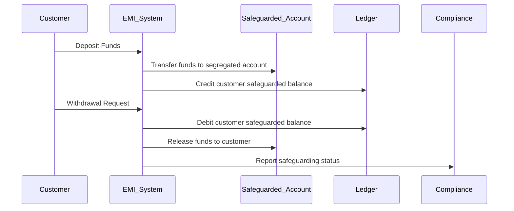
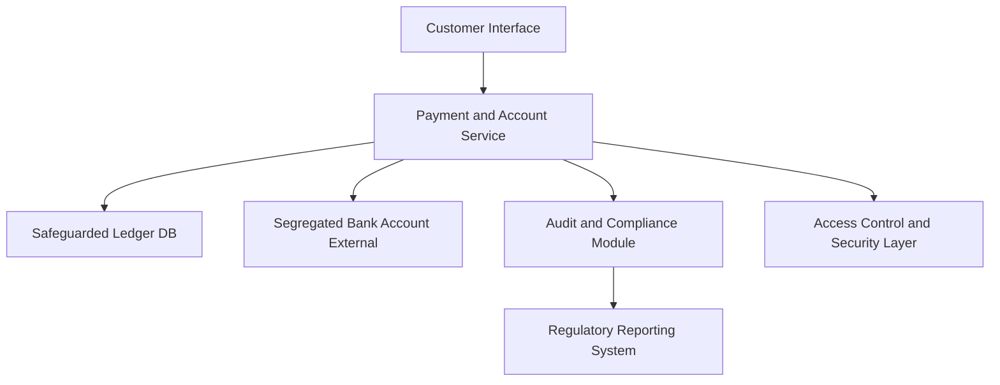

# Safeguarding

## What is Safeguarding?

Safeguarding is a regulatory requirement designed to protect customer funds held by Electronic Money Institutions (EMIs). It ensures that customer money is kept separate and secure, reducing the risk 
that these funds are lost or used improperly if the EMI becomes insolvent.

---

## Why is Safeguarding Important?

- **Protects customer funds** from being used for the EMI's operational expenses or debts.
- Builds **customer trust** in the EMI’s ability to manage money responsibly.
- Helps EMIs comply with regulations like the **EU E-Money Directive (EMD)** and **PSD2**.
- Minimizes financial risk and promotes stability in the fintech ecosystem.

---

## Key Safeguarding Requirements for EMIs

### 1. Segregation of Funds
- Customer funds must be kept separate from the EMI’s own funds.
- Typically involves holding safeguarded funds in dedicated, ring-fenced accounts at authorized credit institutions or high-quality investment instruments.

### 2. Accounting Controls
- EMIs must maintain clear and transparent accounting records that distinguish safeguarded funds from the institution’s own funds.
- Regular reconciliation and internal audits to ensure compliance.

### 3. Limitations on Use of Safeguarded Funds
- Funds can only be used to meet customer redemption requests or to cover expenses directly related to safeguarding (e.g., fees for holding funds).
- Safeguarded funds cannot be used for operational costs unrelated to safeguarding or to pay creditors.

### 4. Reporting and Disclosure
- EMIs must regularly report safeguarding measures and fund levels to regulatory authorities.
- Some jurisdictions require disclosure of safeguarding status to customers.

### 5. Risk Management
- EMIs should have risk management policies to monitor safeguarding effectiveness.
- This includes stress testing and contingency planning for insolvency scenarios.

---

## How Safeguarding Affects Software Architecture

- **Separate ledgers/databases:** Customer balances related to safeguarded funds must be logically or physically segregated.
- **Audit trails:** Detailed, immutable logs of all safeguarding-related transactions and reconciliations.
- **Access controls:** Strict role-based access for safeguarding operations and reporting.
- **Automated reconciliations:** Systems to reconcile customer balances against safeguarded accounts/investments regularly.
- **Compliance monitoring:** Integration of compliance checks and alerts for safeguarding breaches.

---

## Example: Safeguarding Workflow

---

## Example: Simplified Software Architecture for Safeguarding

