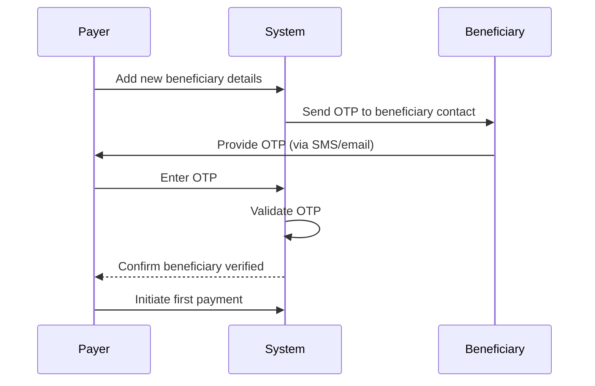

# Beneficiary OTP Verification Before First Payment

## What is Beneficiary OTP Verification?

**Beneficiary OTP Verification** is a security process that requires the payer or the beneficiary 
to confirm the addition of a new beneficiary by entering a One-Time Password (OTP). This OTP is usually 
sent via SMS, email, or an app notification to the beneficiary or payer’s registered contact details.

The goal is to ensure that the beneficiary’s details are genuine and authorized before any funds are sent, 
reducing the risk of fraud or mistaken payments.

---

## Why Use Beneficiary OTP Verification?

- **Fraud prevention:** Confirms that the beneficiary account owner consents to receiving payments.
- **Error reduction:** Prevents payments to incorrect or fraudulent accounts due to input mistakes or scams.
- **Customer assurance:** Gives payers confidence that the beneficiary has been verified before payment.
- **Regulatory compliance:** Helps meet security and anti-fraud regulatory requirements in some jurisdictions.

---

## Typical Beneficiary OTP Verification Flow

1. **Add Beneficiary:** The payer enters the beneficiary’s payment details in the system.
2. **Trigger OTP:** The system sends an OTP to the beneficiary’s registered mobile number or email.
3. **OTP Confirmation:** The payer (or beneficiary) enters the OTP in the system to confirm the beneficiary.
4. **Verification Success:** Once OTP is verified, the beneficiary is marked as “verified” or “approved” for payments.
5. **First Payment Allowed:** The payer can now initiate payments to this beneficiary. Some systems require OTP verification only before the first payment; others may require it periodically or for all payments.

---

## Implementation Considerations

- **OTP Delivery Channel:** Choose secure and reliable channels such as SMS gateways, email services, or authenticator apps.
- **Expiration:** OTPs should expire within a short timeframe (e.g., 5–10 minutes) to reduce risks.
- **Retry Limits:** Limit the number of OTP resend attempts and verification failures to prevent abuse.
- **Data Privacy:** Ensure OTP processes comply with privacy laws; do not expose sensitive data in messages.
- **User Experience:** Provide clear instructions and feedback during OTP verification to avoid confusion.
- **Fallbacks:** Have alternative verification methods (e.g., call center support) if OTP fails.

---

## Example OTP Verification Sequence Diagram (Mermaid)

